# Vibration Tutorial

An interactive, real-time teaching tool for multi-degree-of-freedom mechanical vibration.
It simulates a chain of lumped masses connected by springs and dampers, animates the
motion, and shows the modal-analysis solution for reference, all updating live while
you change parameters.

```
ground ──[k1,c1]── m1 ──[k2,c2]── m2 ──[k3,c3]── m3 ──[k4,c4]── m4
```

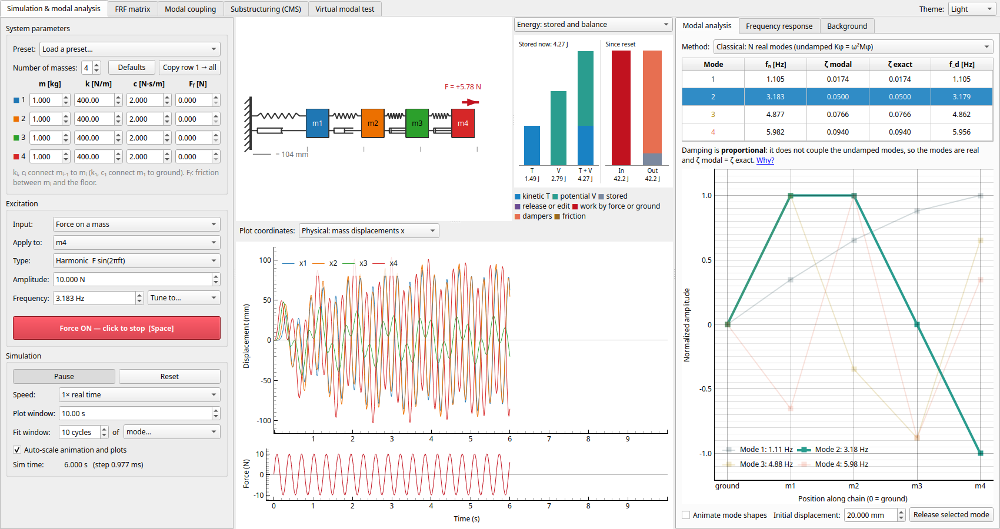

## Quick start

Requires [uv](https://docs.astral.sh/uv/).

```bash
uv sync               # create .venv and install dependencies
uv run vib-tutorial   # launch the app (or: uv run python -m vib_tutorial)
uv run pytest         # run the tests
```

## The window

| Area | What it holds |
|---|---|
| **Left** | System parameters (m, k, c for each element, 1 to 8 masses), the excitation (a force on a mass, or motion of the ground), and simulation controls (run/pause, speed, plot window, auto-scale) |
| **Centre** | Animation of the chain (with a scale bar for the real displacement) and live energy bars, above time histories of the applied force and of the motion (in physical or modal coordinates), of the energy, or of the force in each spring and damper |
| **Right** | Tabs: *Modal analysis* (table, mode shapes, release), *Frequency response*, and *Background* (theory notes written for students) |

Four more pages work on the same chain: **FRF matrix** shows every term of the receptance
matrix and how the modes build it up, **Substructuring (CMS)** reduces the chain by
component mode synthesis (Craig–Bampton, Rubin or MacNeal), **Modal coupling** joins two
halves of the chain one mode each, to show when their modes split, and **Virtual modal test**
measures the FRF from simulated force and response signals, as in a lab (all below).

### Themes

*Theme* (top right) switches the whole app between **Light**, **Dark**, **Solarized** and
**Nord**, live, without resetting the simulation. **System** (the default) follows the
desktop's light or dark setting, and changes with it. Each theme has its own palettes for
the masses, modes and substructures, chosen so every curve, label and table entry stays
legible on its background. The choice is remembered.

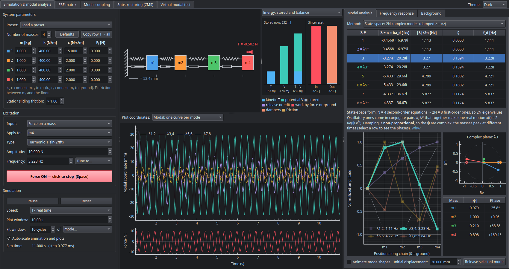

## What you can do

- **Edit any mass, stiffness, or damping value while the simulation runs.** The state is
  kept, so you see the system respond to the change.
- **Apply a force to any mass**: a step, a harmonic `F sin(2πft)`, a rectangular pulse, or a
  chirp (a frequency sweep). Press **Space** (or the button) to switch it on and off, and
  watch the transients as it starts and stops.
- **Shake the ground instead** (base excitation): the wall moves with the same waveforms,
  and the *Frequency response* tab shows the transmissibility (below).
- **Pluck a mass**: drag any mass sideways with the mouse and let go (below).
- **Tune the drive frequency to a natural frequency** from the "Tune to…" menu to see
  resonance build up.
- **Release a mode**: select a mode in the table and click *Release selected mode*. The
  masses start from that mode shape and vibrate freely. The plot window can be fitted to
  a number of cycles of any mode.
- **Switch between two modal-analysis methods** (below), and compare them on the same
  system.
- **Plot the motion in modal coordinates** (*Plot coordinates → Modal*, above the time
  histories): one curve per mode instead of one per mass (below).
- **Watch the energy** in the bars beside the animation: kinetic and potential, an exact
  balance of energy in (release, force) against energy out (stored, dissipated), and each
  mode's share. *Plot coordinates → Energy* draws the same quantities against time (below).
- **Plot the force in every spring and damper** (*Plot coordinates → Element forces*):
  the springs, the dampers, or both together (below).
- **Load a preset** (*System parameters → Preset*): the plain chain, an undamped
  vibration absorber, a tuned mass damper with Den Hartog's tuning, or a damper on the roof
  of a 4-storey building shaken by the ground, each with the excitation that shows it off
  (below).
- **Slow motion** (0.05× to 2×) for the higher modes, and auto-scaled animation and plots
  so small motions stay visible.

### Plucking a mass

Drag any mass in the animation sideways and let go. While you hold it, the force is
switched off and time stands still. The other masses take the static shape a slow pull
gives, with every spring balanced, and a red arrow shows the force your hand needs. Let go
and the chain vibrates freely from that shape. The static shape is close to the first
mode, so most of the energy starts in mode 1 (see *Energy: by mode*). Pull on m1 instead and
more of it goes into the higher modes.

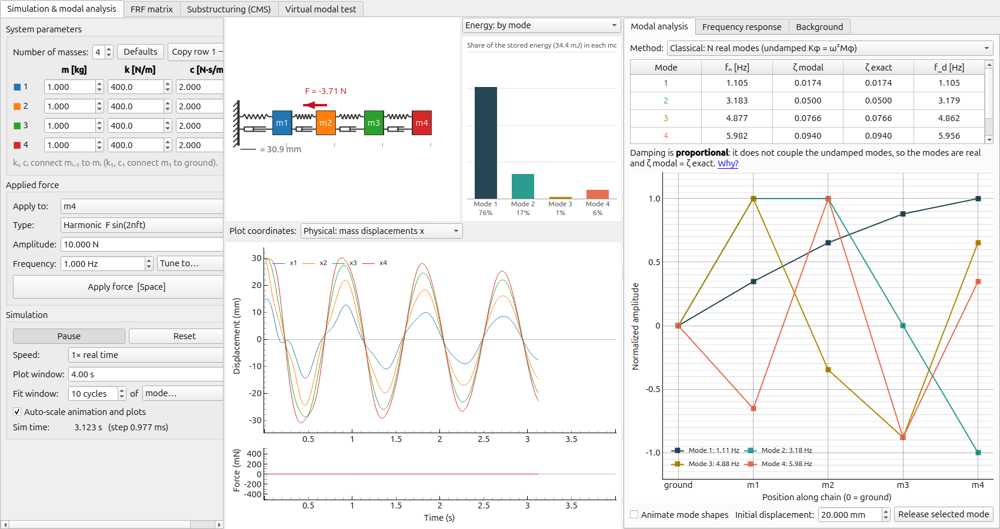

### Chirp and ground motion

*Type → Chirp* sweeps the drive frequency from a start to an end frequency over the sweep
time (linear, or logarithmic for equal time per octave), then stops. Each mode swells in
turn as the sweep passes it, and the dashed drive line on the *Frequency response* tab
follows the frequency. Below, a 40 s sweep from 2 to 7 Hz at m4 is plotted in modal
coordinates: mode 1 rings from the switch-on and decays, then modes 2, 3 and 4 swell
one after the other. Sweep faster and the peaks come later and lower.

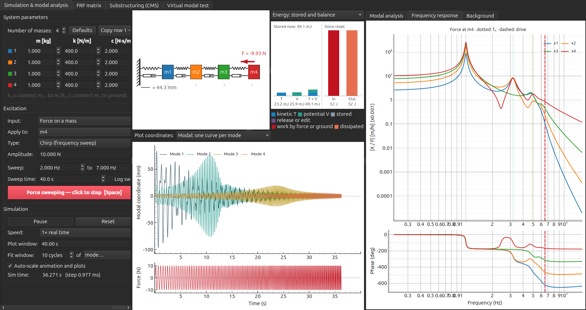

*Input → Ground motion (base)* moves the wall instead of pushing a mass, with the same
waveforms and an amplitude in mm. The ground reaches the chain only through k<sub>1</sub>
and c<sub>1</sub>, as the force k<sub>1</sub>x<sub>g</sub> + c<sub>1</sub>ẋ<sub>g</sub> on m1.
The plots show absolute displacements, the lower plot shows x<sub>g</sub>, and the
*Frequency response* tab shows the transmissibility |X<sub>i</sub>/X<sub>g</sub>|. It is 1
at low frequency, where the chain moves with the ground, and falls away above the modes.
The energy balance counts the work the moving ground does. Element forces, modal
coordinates and energy by mode use the motion relative to the ground.

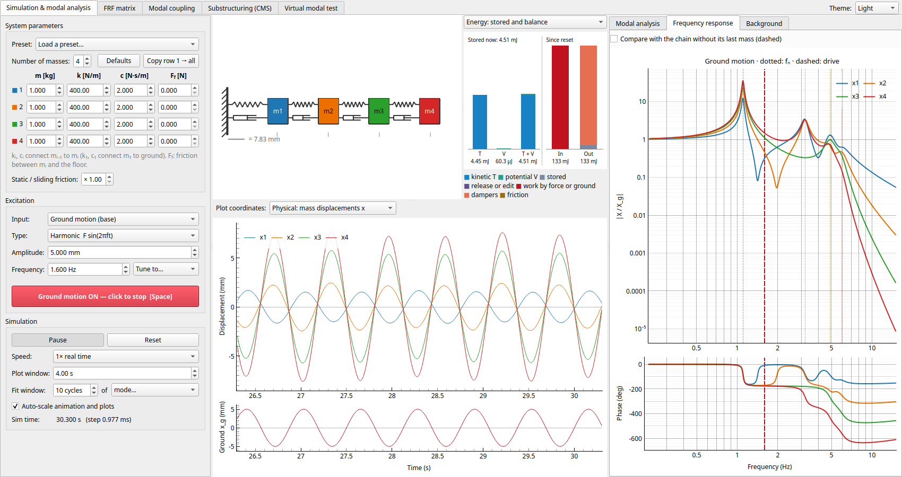

### Vibration absorbers and tuned mass dampers

*System parameters → Preset* loads a chain with one small mass hung on the end of it, tuned
to a mode of the chain it is attached to, and sets up the excitation. The *Frequency
response* tab then also shows the chain without it, thin and dashed (*Compare with the
chain without its last mass*).

- **Vibration absorber (undamped)**: a 0.1 kg absorber on a 1 kg, 3.18 Hz machine, tuned
  to 3.18 Hz with no damper. Driven there, the machine stands still: the absorber's
  spring pushes back with exactly the applied force. The one resonance becomes two, one
  either side.
- **Tuned mass damper (Den Hartog)**: a 5% damper tuned to f<sub>a</sub>/f<sub>1</sub> =
  1/(1 + μ) with ζ<sub>a</sub> = √(3μ/8(1 + μ)³). The resonance at 40 times the static
  deflection becomes two flat peaks under 6. Set c2 to 0 or to 5 to see why the damping
  has an optimum.
- **TMD on a 4-storey building**: the default chain shaken by the ground at its first
  mode, with a damper on the roof sized from mode 1's *modal mass* there
  (1/φ<sub>roof</sub>², φ mass-normalized).

Edit the absorber's k and c to see what mistuning does. The *Background* tab derives the
antiresonance, the fixed points and Den Hartog's tuning.

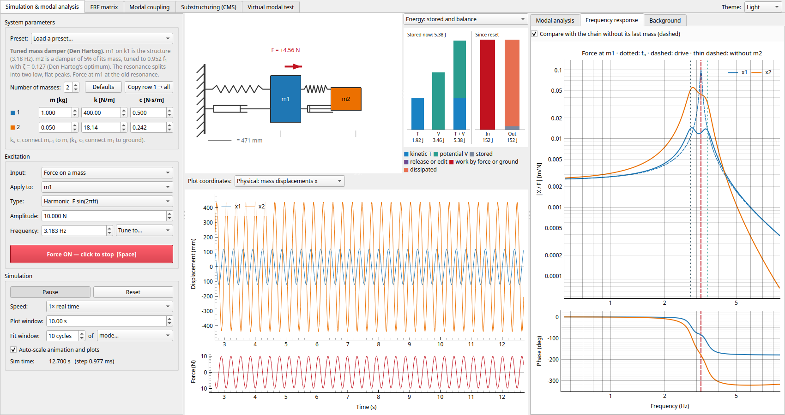

### Two modal-analysis methods

The *Method* selector on the Modal analysis tab switches between two ways of solving for
the modes.

**Classical: N real modes.** The undamped eigenproblem gives N natural frequencies and
real mode shapes; damping is estimated per mode. The table compares this estimate
(ζ modal) with the exact value (ζ exact). The note under the table says whether the
damping is *proportional*. If it is not, the estimate is only an approximation, and
releasing a real mode shape excites other modes too. Below, with only `c1` raised to 15,
the release of mode 3 leaves slow mode-1 motion behind:

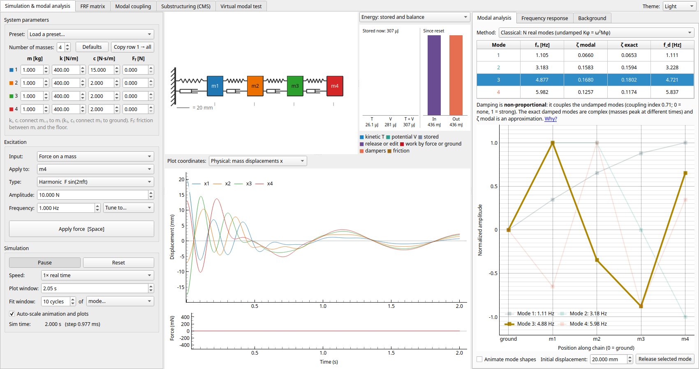

**State-space: 2N complex modes.** The full damped problem is solved in first-order form,
which gives all 2N eigenvalues: complex-conjugate pairs λ, λ* for oscillatory modes (and
real eigenvalues for overdamped or rigid-body motion). Selecting a row shows its complex
mode shape in a complex-plane (phasor) plot, with the amplitude and phase of each mass.
Phases other than 0° or 180° mean the masses peak at different times. Releasing a
complex mode sets both displacement and velocity, so on the same system only that mode
responds and decays cleanly:

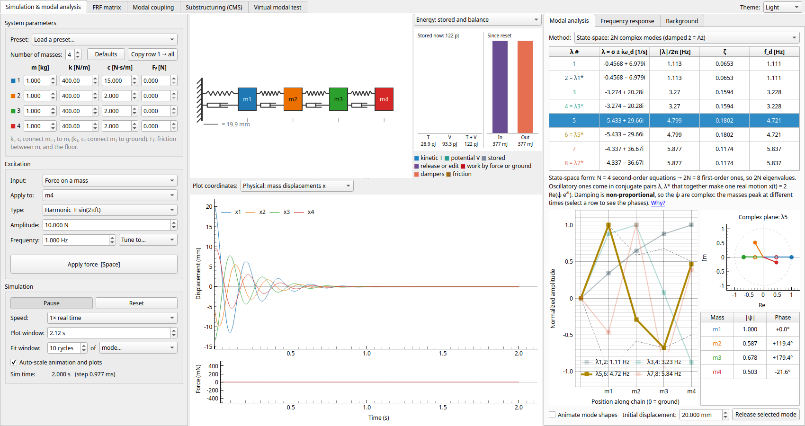

### Modal coordinates

*Plot coordinates → Modal* splits the motion into one curve per mode. Each curve is that
mode's share of the displacement of the mass it moves most, so its size compares
directly with the physical plot. The curves follow the *Method* selector:

- **Classical**: q = Φ<sup>T</sup>Mx with the real mode shapes, so x = Σ φ<sub>r</sub>q<sub>r</sub>
  exactly. With non-proportional damping these coordinates are coupled. Release mode 3 with
  `c1` = 15 and modes 1 and 2 pick up motion.
- **State-space**: η = V<sup>−1</sup>z with the complex eigenvectors, one curve 2 Re(η) per
  conjugate pair. These decouple for any damping. A released complex mode moves only its
  own curve.

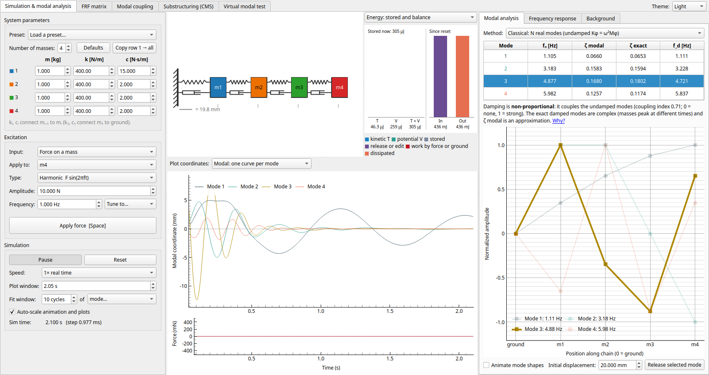

### Energy

The panel beside the animation has two views:

- **Stored and balance**: kinetic energy T, potential energy V and their sum, then a ledger
  since the last reset. *In* is the energy given by a release or a parameter edit plus the
  work done by the force. *Out* is the energy stored now plus the energy dissipated by the
  dampers. The simulator integrates the work and the dissipation exactly, so the columns
  always match.
- **By mode**: each undamped mode's share of the stored energy,
  ½(q̇<sub>r</sub>² + ω<sub>r</sub>²q<sub>r</sub>²). The shares always add up to T + V. With
  non-proportional damping the dampers move energy between modes. Release mode 3 with
  `c1` = 15 and within a second most of the energy left is in mode 1.

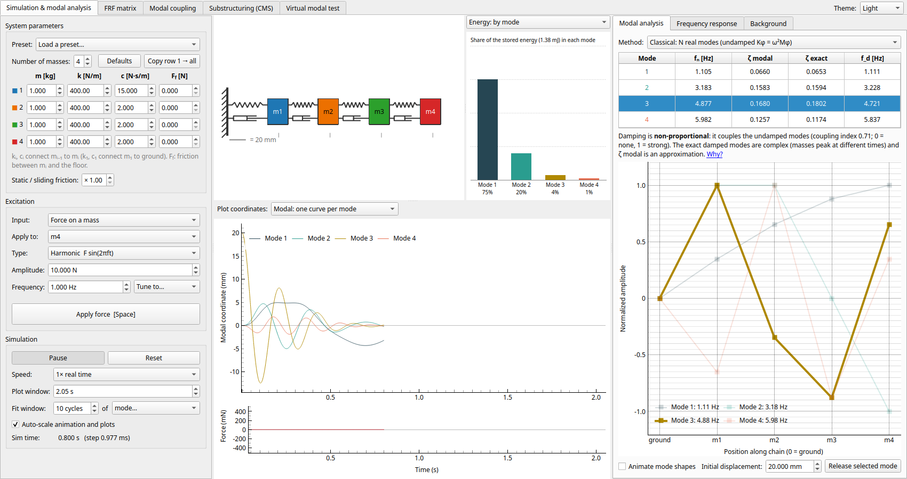

*Plot coordinates → Energy* draws the ledger as time histories: T, V and T + V, the energy
given by releases and edits E<sub>0</sub>, the work done by the force W, and the energy
dissipated D. At every sample E<sub>0</sub> + W = T + V + D. Release a mode and T and V
swap twice per cycle while T + V decays and D rises towards E<sub>0</sub>. Drive the
chain just below a natural frequency and the stored energy beats. W falls whenever the
force pushes against the motion, and D keeps rising.

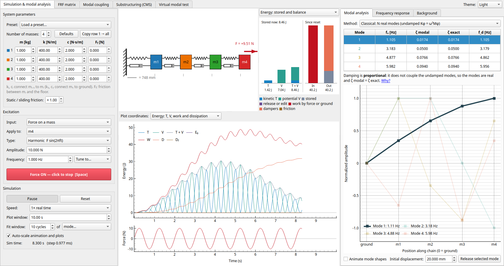

### Element forces

*Plot coordinates → Element forces* plots the tension in each element, in the colour of
its row under *System parameters*. Element i joins mass i−1 to mass i, and element 1 joins
mass 1 to the ground. A second menu picks what to plot:

- **Springs**: k<sub>i</sub>(x<sub>i</sub> − x<sub>i−1</sub>)
- **Dampers**: c<sub>i</sub>(ẋ<sub>i</sub> − ẋ<sub>i−1</sub>)
- **Spring + damper**: the total force the element carries. For element 1 this is the
  force on the ground.

Positive is tension. Apply a step force at the last mass and every spring rings about the
same static force, overshooting to about twice it. Once the motion dies away every spring
carries exactly the applied force and the dampers carry none. At resonance the elements
carry several times the applied force, and the damper force leads the spring force by a
quarter cycle.

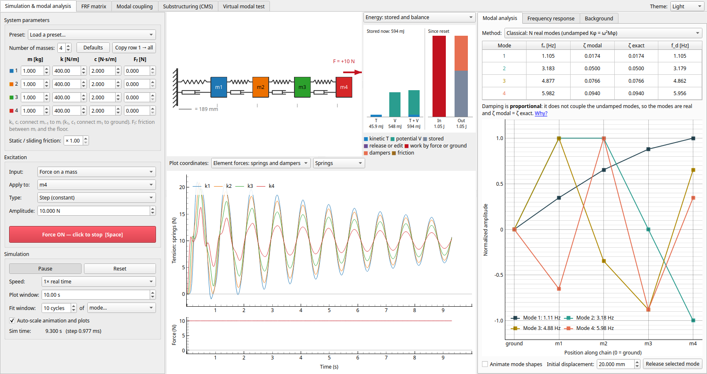

### Frequency response

The receptance |X_i / F| and phase of every mass for a force at the selected mass. The
natural frequencies are dotted and the current drive frequency is dashed.

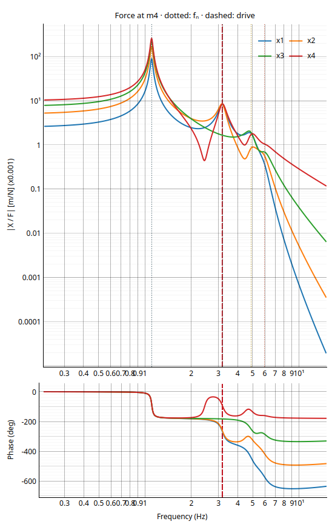

### FRF matrix

The *Frequency response* tab shows one column of the receptance matrix. The **FRF matrix**
page shows all N × N terms H<sub>jk</sub> = x<sub>j</sub>/F<sub>k</sub> as a grid of small
plots (row: response, column: force), on shared axes so their sizes compare directly.

- **Show** magnitude, phase (unwrapped), real part or imaginary part. The large plot on the right
  shows the selected term as magnitude with phase, or real with imaginary part.
- **Modes included in the sum**: each term is a sum of one term per mode. Untick modes to see
  the truncated modal sum (dashed red) against the full solution (black), and each mode's term
  in its own colour. The real part shows best how the terms add. The large plot shades the
  frequency band where the sum differs most from the full solution, and lists the **static
  compliance** (ω = 0): the ticked modes' sum against K⁻¹, and each mode's share of it.
- **Exact or classical terms**: the exact expansion uses the complex (state-space) modes and
  always sums to the full solution. The classical one uses the real modes with ζ modal, and
  misses even with every mode when damping is non-proportional.
- **Several forces at once**: Ctrl+click more plots in a row, or tick more forces, to see
  x<sub>j</sub> = Σ<sub>k</sub> H<sub>jk</sub>F<sub>k</sub> built from its terms.
- **Theory**: reciprocity, modal constants, why antiresonances appear (and how many), and
  truncation.

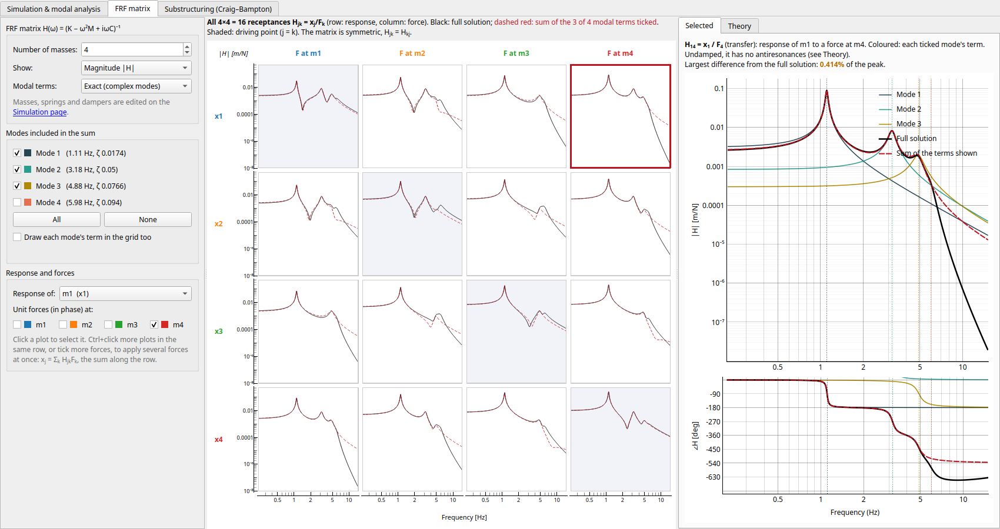

### Substructuring (component mode synthesis)

The *Substructuring* page starts with the whole chain as one substructure, whose only
boundary DOF is the tip: the single-component case, to learn the fundamentals on (Guyan then
reduces it to that one DOF, the largest error the page can show). Click masses under
*Interfaces at* to cut the chain there into substructures A (grounded), B, C, ... up to the
free end, and click them again to remove the cuts. The boundary (master) DOFs are the interfaces and the last mass, which is where
the force is applied, so the loaded DOF stays physical. Each substructure keeps its own
chosen number of modes plus one static shape per boundary DOF, and the reduced
substructures are assembled on the shared interface DOFs. The
*Method* selector chooses the component modes:

- **Craig–Bampton** (fixed interface): modes with the boundary held, plus constraint modes.
- **Rubin** (free interface): modes with the boundary free, as a modal test would measure
  them, plus the *residual flexibility* of the discarded modes. B floats on its own, so its
  rigid-body mode is always kept.
- **MacNeal** (free interface): as Rubin, but the residual flexibility is massless, so the
  boundary DOFs carry no inertia and the model has only as many modes as modes kept.

Everything on the page follows the selector:

- **Comparison table**: true vs reduced natural frequencies, the error (never negative for
  Craig–Bampton and Rubin, whose frequencies are upper bounds), and the MAC of the recovered
  shape.
- **Substructures on their own**: each substructure's own modes (natural frequency and
  exact damping ratio with its boundary held, or free), whether each is kept, and the
  coupled mode it becomes (largest share of that mode's energy).
- **Component shape overlay**: click a row of that table to draw the clamped component
  shape over the coupled mode it becomes.
- **Basis (T)**: every column of T drawn as a shape along the chain, the set of shapes every
  reduced-model motion is built from.
- **Modes & FRF**: the selected mode shape, true vs reduced, and the tip and interface
  receptance of both models for the force at the tip.
- **Time response**: the reduced model simulated beside the full one, with the same exact
  stepper and the same force at the tip (a step, a harmonic, or a pulse). The two chains are
  animated one above the other at the same scale, over time histories of the tip and interface
  and of their difference. All three methods are exact statically, so the error is in the
  vibration: small after a step, large when driven at a mode the reduced model has shifted
  (below). *Tune to…* offers the true and the reduced natural frequencies.
- **Back expansion**: the coupled (reduced) model solves only for [q, x<sub>b</sub>]; this tab
  recovers the interior masses from them afterwards, as a system analyst does with a
  substructure delivered as reduced matrices. Three recoveries of one interior mass and one
  spring force are compared with the truth: from the coupled solution with the reduced
  model's own T (split into the part the boundary drags along and the part the kept modes
  add), from the boundary motion alone (static), and *enhanced*, by re-solving the
  substructure's interior with the coupled model's boundary motion imposed. The lower chain
  draws the recovered masses hollow.
- **Compare methods**: the same cut reduced by all three methods, with the frequency error of
  every mode, and how the selected mode's error falls as modes are added, one at a time.
- **Matrices (step by step)**: every stage with the current numbers: the full K and M,
  each substructure's partitioned matrices, its component modes (kept and discarded), the
  constraint modes Ψ or the residual flexibility G<sub>d</sub>, the transformation T, the
  reduced matrices, the assembled reduced model, and each substructure's recovery (OTM) and
  loads (LTM) transformation matrices.
- **Theory**: what a basis is (with a 2-mass worked example) and why Craig–Bampton chooses
  its shapes, original vs substructured formulation side by side, Hurty vs Craig–Bampton,
  Guyan reduction as the zero-mode case, why free-interface modes need residual flexibility,
  MacNeal vs Rubin, the three methods side by side, back expansion (data recovery), a "Try it"
  walkthrough, and a notation
  table.
- **Presets**: *Guyan (0 modes)* (*Fewest modes* for the free-interface methods) and *All
  modes*.

With more cuts each substructure is smaller and has fewer modes to keep, but every interface
stays in the model as a physical DOF. For 8 masses and a 6-DOF model, one cut with 2 modes
each gets modes 1 to 4 within 0.7%; two cuts with 1 mode each only within 2.3%:

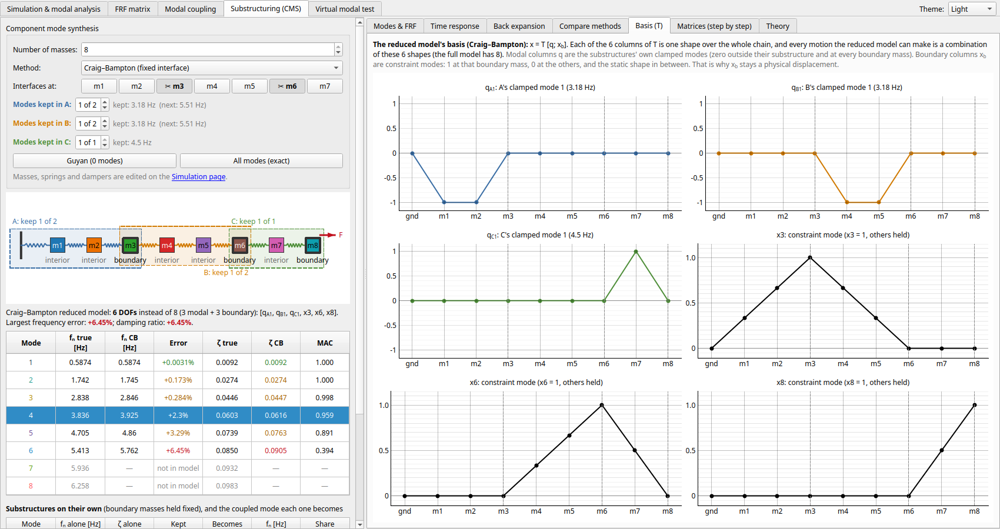

For each substructure, partitioned into interior $i$ and boundary $b$ DOFs,

$$\begin{bmatrix}x_i\\ x_b\end{bmatrix} = \underbrace{\begin{bmatrix}\Phi_k & \Psi\\ 0 & I\end{bmatrix}}_{T}\begin{bmatrix}q\\ x_b\end{bmatrix},
\qquad \Psi = -K_{ii}^{-1}K_{ib},\qquad \hat M = T^TMT,\ \hat K = T^TKT$$

where $\Phi_k$ are the $k$ lowest mass-normalized modes of $K_{ii}\phi = \omega^2 M_{ii}\phi$.
$\hat K$ is block diagonal, $\mathrm{diag}(\omega_k^2)$ and $K_{bb} - K_{bi}K_{ii}^{-1}K_{ib}$, while
$\hat M$ couples $q$ to $x_b$.

The free-interface methods use the lowest $k$ modes $\Phi_k$ of the whole substructure,
$K\phi = \omega^2 M\phi$, and keep the static response of the discarded ones through the
residual flexibility $G_d = \Phi_d\Lambda_d^{-1}\Phi_d^T$. Writing
$x = \Phi_k q + G_d E_b f_b$ and eliminating the interface forces $f_b$ with the boundary
rows gives a transformation of the same shape as Craig–Bampton's:

$$T = \begin{bmatrix}\Phi_{ik} - R\,\Phi_{bk} & R\\ 0 & I\end{bmatrix},\qquad R = G_{ib}G_{bb}^{-1}$$

Rubin's method projects with it, $\hat M = T^TMT$; MacNeal's drops the residual mass,
$\hat M = \mathrm{diag}(I, 0)$. Both have $\hat K = T^TKT$, which now couples $q$ to $x_b$.

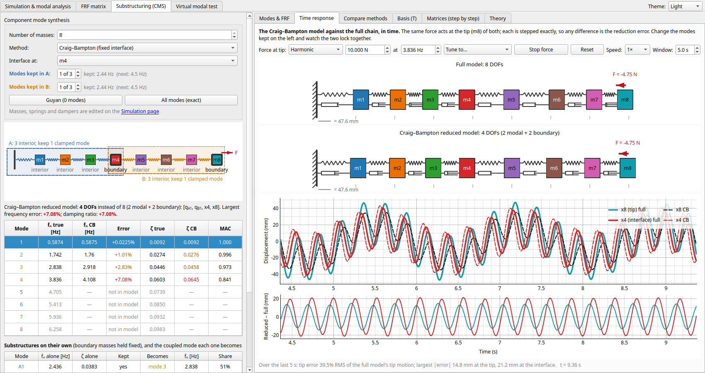

After the coupled solve each substructure recovers its interior from its own rows of T,
$x_i = \Psi x_b + \Phi_k q$ (Craig–Bampton). The *enhanced* recovery instead solves
$M_{ii}\ddot x_i + C_{ii}\dot x_i + K_{ii}x_i = -K_{ib}x_b - C_{ib}\dot x_b$ with the coupled
model's $x_b(t)$, so it keeps every interior mode and its only error is the error in $x_b$:

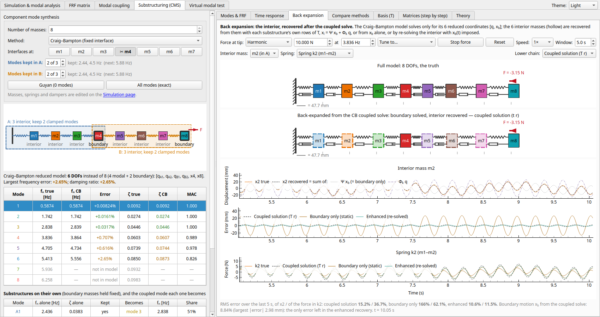

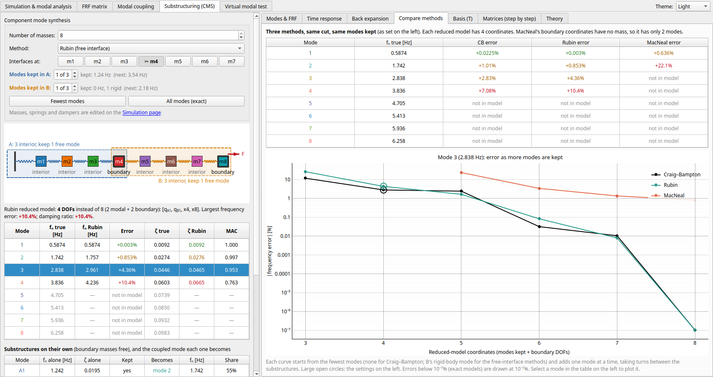

### Modal coupling

Two systems that are each fine on their own can misbehave once joined: when a mode of one is
close in frequency to a mode of the other, and the masses are not too different, the two
modes **split**. This is how a vibration absorber works, but it usually happens when nobody
meant it to. The **Modal coupling** page shows it on the chain. *Split after* cuts the chain into
**A** (the masses up to the cut, on the ground as before) and **B** (the rest, with the spring
and damper that joined it to A tied to the ground instead). Each is solved on its own, one mode of
each is replaced by a single-DOF oscillator that keeps its frequency and modal damping ratio, and
the two oscillators are joined again, B's on A's:

```
ground ──[k_a,c_a]── m_a ──[k_b,c_b]── m_b
```

The oscillator masses are the masses the joint feels:

- **B**: its **effective mass** along x, Γ² with Γ = φ<sup>T</sup>M**1** (φ mass-normalized),
  since B is joined at its base. The rest of B's mass (its other modes) moves rigidly with the
  base, so it is added to m<sub>a</sub> as B's **residual mass**.
- **A**: its **modal mass at the interface**, 1/φ<sub>tip</sub>², since A is joined at its tip.
  A's effective mass can be chosen instead, to see how much worse it does.

With these choices the 2-DOF model is a Rayleigh–Ritz model of the chain (B's part is
Craig–Bampton with one mode kept), so its two frequencies are upper bounds of the chain's lowest
two. The page compares them with the chain's (frequency, exact damping ratio, MAC), draws the
2-DOF modes on the chain, and compares the receptance at the interface. Any mode of A can be
coupled with any mode of B.

The **Veering & splitting** tab sweeps B's frequency (or the mass ratio μ = m<sub>b</sub>/m<sub>a</sub>)
and plots the chain's and the 2-DOF model's frequencies. Near f<sub>B</sub> = f<sub>A</sub> the two
modes veer apart instead of crossing; two oscillators tuned exactly end up √μ·f<sub>a</sub> apart,
whatever μ.

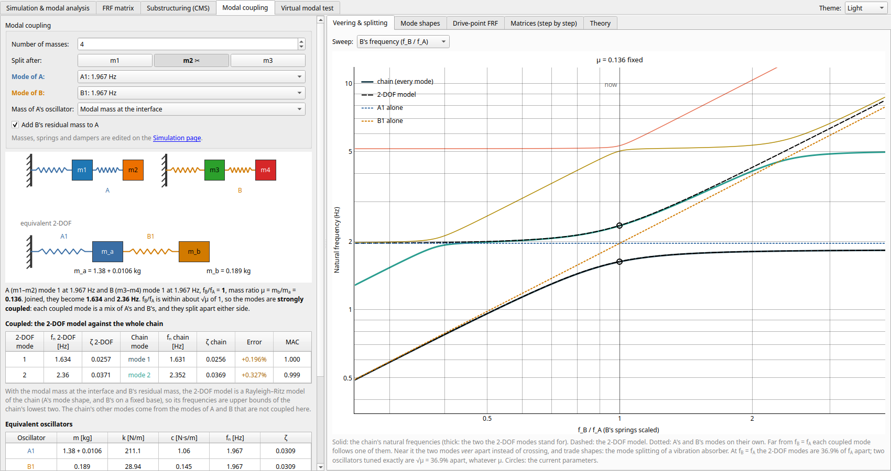

### Virtual modal test

The **Virtual modal test** page measures the FRF the way a lab does: from sampled force and
response signals alone, never from M, C and K. A force excites one mass, every mass's
displacement is recorded, and the FRF column is estimated and drawn over the exact one.
Each step of the measurement, and each error it can bring in, can be switched on and off.

- **Excitation**: impact hammer (the tip sets the pulse length, and so how high it
  excites), continuous random, burst random, periodic random, periodic chirp, or stepped
  sine. The response is simulated with the same exact first-order-hold discretization as
  the simulator.
- **Acquisition**: sample rate (automatic, or set by hand), block size (which sets
  Δf = f<sub>s</sub>/N<sub>b</sub>), averages, overlap, and an anti-alias filter. Turn the filter
  off and a mode above Nyquist folds back into the band.
- **Noise** on the force and on the responses, as a percentage of each channel's peak.
- **Processing**: rectangular, Hann, flat-top, or force + exponential windows, and the H1 or
  H2 estimator, with coherence. With the exponential window, a dashed curve shows the exact
  FRF with the damping the window adds.
- Noise and processing act on the data already measured, so the same test can be compared
  with different windows, estimators or noise levels. Blocks are measured a few per frame,
  so the average can be watched settling.
- **Setup check**: each mode's half-power bandwidth against Δf, how much of a hit is left
  at the end of the block, the hammer's level at each mode, and aliasing.
- **Theory**: sampling and aliasing, the DFT and leakage, windows, averaging, H1 against H2,
  coherence, and the excitation types.

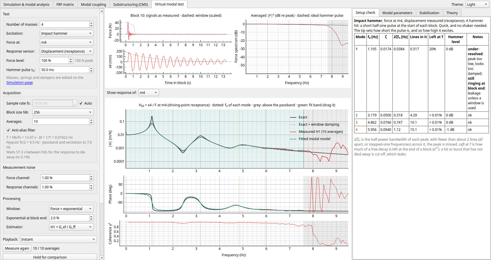

**Modal parameters** are then extracted from the measured FRF column and compared with the
exact modes:

- **Peak picking**: a mode at each peak, damping from the half-power bandwidth, the shape from
  the FRF at the peak. It shows the limits of the line spacing.
- **Circle fit**: ω<sub>n</sub> and ζ from the angles on each mode's mobility circle, between
  the frequency lines.
- **LSCF + LSFD**: a common-denominator fit of every response at every model order, shown as a
  **stabilization diagram**. The stable columns are picked automatically, and you can click
  poles to add or remove them. Residues and residual terms then come from a least-squares fit.
- A **fit band**, dragged on the FRF plot, sets which lines are fitted. The fitted modal model
  is drawn over the measurement.
- The **Modal parameters** tab lists f<sub>n</sub>, ζ and MAC against the exact modes (missed
  and extra modes included), with a MAC matrix. The exponential window's damping can be
  removed from the identified poles.

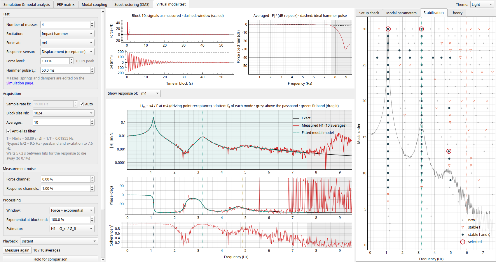

## The math, briefly

The *Background* tab in the app explains this in more depth; this is the outline.

**Model.** Newton's second law for each mass gives

$$M\ddot{x} + C\dot{x} + Kx = f(t)$$

where $M$ is diagonal (the masses) and $C$, $K$ are tridiagonal, assembled element by
element: each spring or damper between two neighbours adds $\begin{bmatrix}v & -v\\ -v & v\end{bmatrix}$
to their rows and columns (element 1 connects to ground). Everything is SI.

**Classical modal analysis.** Ignoring damping, $x = \phi\cos\omega t$ gives the symmetric
generalized eigenproblem $K\phi = \omega^2 M\phi$, which has N real natural frequencies
$\omega_r$ and real mode shapes $\phi_r$. With mass-normalized shapes collected in $\Phi$,
$\Phi^T M\Phi = I$ and $\Phi^T K\Phi = \mathrm{diag}(\omega_r^2)$. Damping is estimated
from the diagonal of $\Phi^T C\Phi$:

$$\zeta_r = \frac{\phi_r^T C\,\phi_r}{2\omega_r}$$

This is exact only if $\Phi^T C\Phi$ is diagonal (*proportional* damping, e.g.
$C = \alpha M + \beta K$). The app reports a coupling index, the largest off-diagonal term
relative to the diagonal, to show how far from proportional the damping is.

**State-space (complex) modal analysis.** With $z = [x,\ \dot{x}]$ the N second-order
equations become 2N first-order ones:

$$\dot{z} = Az + Bf, \qquad A = \begin{bmatrix} 0 & I \\ -M^{-1}K & -M^{-1}C \end{bmatrix}$$

The eigenproblem $A\psi = \lambda\psi$ is exact for any damping. It has 2N eigenvalues,
$\lambda = -\zeta\omega_n \pm i\omega_d$ in conjugate pairs, and eigenvectors of the form
$[\psi_x,\ \lambda\psi_x]$. One pair together gives a real motion
$x(t) = 2\,\mathrm{Re}(\psi_x e^{\lambda t})$. With non-proportional damping $\psi_x$ is
complex, so each mass has its own phase. The two methods are linked by matching each
damped pair to the undamped mode it most resembles (the modal assurance criterion, MAC).

**Modal coordinates.** Each method gives a change of coordinates that the time histories
can plot. Classical: $x = \Phi q$, so $q = \Phi^T M x$, and the equations become

$$\ddot{q} + \Phi^T C\Phi\,\dot{q} + \mathrm{diag}(\omega_r^2)\,q = \Phi^T f$$

which separate into N single-DOF equations only if $\Phi^T C\Phi$ is diagonal. Otherwise
damping transfers motion between the $q_r$. State-space: $z = V\eta$, so $\eta = V^{-1}z$,
and $\dot{\eta} = \Lambda\eta + V^{-1}Bf$ is decoupled for any damping. A conjugate pair
contributes $2\,\mathrm{Re}(\psi_x\eta_r)$ to $x$. The app scales each coordinate to the
mode's displacement at the mass where its normalized shape is 1: $\phi_{r,\max}\,q_r$
and $2\,\mathrm{Re}(\eta_r)$.

**Ground motion.** When the wall moves as $x_g(t)$, element 1 stretches by $x_1 - x_g$,
so the ground enters as a force on mass 1:

$$M\ddot{x} + C\dot{x} + Kx = (k_1x_g + c_1\dot{x}_g)\,e_1, \qquad
\frac{X}{X_g} = H(\omega)\,e_1\,(k_1 + i\omega c_1)$$

The simulator steps this exactly for a piecewise-linear $x_g$ by adding $x_g$ and its
slope to the state of the matrix exponential, as for the energy integrals below.

**Frequency response.** The receptance is solved directly at each frequency:
$H(\omega) = (K - \omega^2 M + i\omega C)^{-1}$. It is also a sum of modal terms. With the
state-space eigenvectors $V$ (and $V^{-1}$), every eigenvalue contributes a residue matrix,

$$H(\omega) = \sum_{r=1}^{2N} \frac{R_r}{i\omega - \lambda_r}, \qquad R_r = (V)_{x,r}\,(V^{-1})_{r,\dot{x}}\,M^{-1}$$

which is exact for any damping. For proportional damping it reduces to the classical
$H = \sum_r \phi_r\phi_r^T / (\omega_r^2 - \omega^2 + 2i\zeta_r\omega_r\omega)$.

**Energy.** Multiplying the equations of motion by $\dot{x}^T$ gives the power balance

$$\frac{d}{dt}\Big(\tfrac12\dot{x}^TM\dot{x} + \tfrac12 x^TKx\Big) = f^T\dot{x} - \dot{x}^TC\dot{x}$$

so the energy given plus the work done by the force equals the energy stored plus the
energy dissipated. With $q = \Phi^T Mx$ the stored energy is
$\sum_r \tfrac12(\dot{q}_r^2 + \omega_r^2 q_r^2)$ for any damping. The off-diagonal terms of
$\Phi^T C\Phi$ move energy between these terms.

**Time simulation.** The simulator advances $\dot{z} = Az + Bf$ with the exact
discrete-time solution. Over a step $h$, with the force varying linearly across the step
(first-order hold),

$$z_{k+1} = e^{Ah}z_k + \Gamma_0 f_k + \Gamma_1 f_{k+1}$$

where $e^{Ah}$, $\Gamma_0$ and $\Gamma_1$ come from a single matrix exponential of an augmented
matrix. The free response is exact, so the scheme is unconditionally stable and adds no
numerical damping, however stiff the springs are made: any decay you see is physical. The
step size adapts to the fastest mode, the drive frequency and the pulse length.

The work and dissipation over a step are integrals of quadratic forms in the state and
force. Adding the force and its slope to the state makes the step a linear system
$\dot{w} = A_w w$. Van Loan's matrix exponential then gives each integral exactly as
$w_k^T W w_k$, so the energy balance closes to rounding error.

## Code layout

- `core/model.py`: assembles $M$, $C$, $K$ and the state-space matrices, and the force in each element.
- `core/modal.py`: classical modes (`scipy.linalg.eigh`), all 2N state-space eigenpairs
  (`scipy.linalg.eig`), the MAC pairing, the modal-coordinate map, and the frequency response.
- `core/frf_matrix.py`: the full receptance matrix and its modal (pole–residue) terms.
- `core/simulator.py`: the exact first-order-hold time stepper and its exact energy ledger.
- `core/presets.py`: the preset chains, vibration absorbers and Den Hartog's tuning.
- `core/energy.py`: kinetic, potential and stored energy, and the energy in each mode.
- `core/measurement.py`: the virtual modal test: excitation signals, a fast exact response
  (the FOH update diagonalized into one first-order filter per eigenvalue), anti-alias
  filtering and sampling, noise, windows, and the H1/H2 and coherence estimates.
- `core/identification.py`: modal parameter extraction from a measured FRF column: peak
  picking, circle fit, LSCF with its stabilization diagram, LSFD, and matching to the exact
  modes (MAC).
- `core/substructure.py`: component mode synthesis (Craig–Bampton, Rubin, MacNeal), mode
  comparison (frequency error, MAC) and the reduced-model FRF.
- `core/cms_response.py`: the full chain and a reduced model stepped side by side under the
  same force (MacNeal's massless boundary condensed statically).
- `core/back_expansion.py`: recovery of the interior DOFs from the coupled solution (by T,
  from the boundary alone, and by re-solving each interior with the boundary motion imposed,
  stepped in the same exact update) and of the spring forces.
- `gui/`: the PySide6 and pyqtgraph interface. It runs on a ~60 fps timer that advances
  the simulator by wall-clock time × speed. `gui/style.py` holds the colour themes; every
  widget reads its colours from the current one (`colors.mass[i]`, `colors.force`) and
  redraws in a new one through its `apply_theme()`.

The `core` package has no Qt dependency, so you can use it from scripts or notebooks:

```python
from vib_tutorial.core import ChainSystem, modal_analysis

chain = ChainSystem([1.0] * 4, [400.0] * 4, [15.0, 2.0, 2.0, 2.0])
res = modal_analysis(chain)
[(m.fn_hz, m.zeta_modal, m.damped.zeta) for m in res.modes]    # classical, N modes
[(m.eigenvalue, m.shape) for m in res.complex_modes]           # state-space, 2N modes

import numpy as np
from vib_tutorial.core import Simulator, modal_coordinate_map

sim = Simulator(chain)
sim.set_displacement(0.01 * res.modes[2].shape)                # release classical mode 3
t, x, v, f = sim.advance(2.0)                                  # per-step samples
z = np.hstack([x, v])
q = z @ modal_coordinate_map(chain, res)                       # classical, (steps, N), m
eta = z @ modal_coordinate_map(chain, res, complex_modes=True) # one per pair, m

from vib_tutorial.core import modal_energies

E = modal_energies(chain, res, x, v)                           # (steps, N), J; rows sum to T + V
sim.energy_added + sim.work - sim.dissipated - sim.stored_energy  # ~1e-15 J: exact balance
added, work, dissipated = sim.ledger.T                          # the same ledger at each step of the last advance

from vib_tutorial.core import ForceController, ForceKind, ForceSettings, element_forces, pluck_shape, transmissibility

spring, damper = element_forces(chain, x, v)                   # (steps, N) tension, N
sim.set_displacement(pluck_shape(chain, 1, 0.02))              # hold m2 at 20 mm, then let go

shake = ForceController(ForceSettings(kind=ForceKind.CHIRP, sweep_start_hz=0.5, sweep_end_hz=8.0,
                                      base=True, base_amplitude=0.005))  # 5 mm ground sweep
sim = Simulator(chain, shake)
shake.switch_on()
t, x, v, xg = sim.advance(2.0)                                 # xg: the ground motion, m
transmissibility(chain, np.array([0.5, 2.0]))                  # X / X_g, (freqs, N)

from vib_tutorial.core.presets import den_hartog, tuned_mass_damper, with_absorber

tmd = tuned_mass_damper(ChainSystem.uniform(4), mu=0.05)       # 5-mass chain, damper on m4 tuned to mode 1
den_hartog(0.05)                                               # (f_a / f_1, zeta_a) = (0.952, 0.127)

from vib_tutorial.core import compare_modes, craig_bampton

s = ChainSystem.uniform(8)
cb = craig_bampton(s, interfaces=[3], n_kept=[1, 1])          # cut at m4, 1 mode each
[(c.fn_true, c.fn_red, c.mac) for c in compare_modes(cb, modal_analysis(s))]

from vib_tutorial.core import free_interface
from vib_tutorial.core.cms_response import CMSResponse

rubin = free_interface(s, interfaces=[3], n_kept=[1, 1])       # B keeps its rigid-body mode
macneal = free_interface(s, [3], [1, 1], residual_mass=False)  # massless residual: 2 modes

step = ForceController(ForceSettings(kind=ForceKind.STEP, amplitude=10.0))
both = CMSResponse(cb, step)                                   # full and reduced, same force at the tip
step.switch_on()
t, x_full, x_cb, f = both.advance(2.0)                         # (steps, N) each; x_cb = T r

from vib_tutorial.core import (Acquisition, Excitation, FrfEstimator, MeasurementSettings,
                               Processing, Window)

acq = Acquisition(chain, MeasurementSettings(excitation=Excitation.RANDOM, input_dof=3,
                                             fs=20.0, block=1024, averages=20, overlap=0.5))
while not acq.done:
    acq.step()                                                 # one block per step
est = FrfEstimator(acq, Processing(window=Window.HANN, response_noise=0.02)).estimate()
est.freqs, est.H, est.coherence                                # (F,), (F, N), (F, N)

from vib_tutorial.core.identification import auto_select, lscf, lsfd, match_modes

band = (0.0, acq.settings.band)
stab = lscf(est.freqs, est.H, band, max_order=30)              # poles at every order
ident = lsfd(est.freqs, est.H, band, [stab.pole(o, i) for o, i in auto_select(stab)])
[(r.mode, r.identified and r.identified.fn_hz, r.mac) for r in match_modes(ident.modes, res, 8.0)]
```

## Ideas for extension

- Save and load parameter presets for classroom exercises
